# Milestone-Project: Creative Design

Creative Design is a website that enables to showcase skills, abilities, experiences, and accomplishments to potential employers, clients, or collaborators. By doing so, it helps establish a robust online presence and create a professional brand image that aligns with their values, mission, and target audience.

## TABLE OF CONTENTS
| Section |
| --- |
| [Title and desciption](#milestone-project) |
| [Features](#features) |
| [UX / UI](#uxui-section) |
| [Testing](#testing) |
| [Unfixed Bugs](#unfixed-bugs) |
| [Deployment](#deployment) |
| [Credit](#credit) |

## FEATURES
- Responsive navigation bar that collapses into a hamburger menu on smaller screens for better user experience.
- Hero section featuring a captivating background image and a prominent title and description that immediately grabs the user's attention.
- About section showcasing the designer's experience and skills through a carefully curated image and informative text.
- Services section that presents three distinct web development services using eye-catching cards to capture the user's interest.
- Contact section with a user-friendly form that allows visitors to easily send messages to the designer.

## FEATURES THAT CAN BE IMPLEMENTED
- Portfolio page with projects links.
- Dark Mode.

## UX/UI SECTION 

## Site Goal

The primary goal of this portfolio is to showcase my skills and experience as a Designer & Developer, and to present myself as a strong candidate for potential job opportunities or collaborations.
Specifically, the portfolio aims to:

- Highlight my skills and strengths, including technical expertise, soft skills, and personal qualities that set me apart from others in my field.
- Make it easy for potential employers, clients, or collaborators to contact me and learn more about my work.
- To achieve these goals, the portfolio will feature a clean and professional design, high-quality visuals and multimedia content, and clear navigation and organization of information.

## User Story

As a User:
- I want to be able to easily navigate through the website and find the information or services I need quickly.
- I expect to see a clear and organized layout that directs me to the different sections of the site. The navigation bar should be easily accessible and include links to the main pages such as the home page, about us, services, and contact us.
- If I need to contact the website owner or customer support, I expect to find the contact information easily, either on the main navigation bar or on the footer of the website.
- I expect the website to be responsive and optimized for different screen sizes and devices. This means that the website should look and function well on desktops, laptops, tablets, and smartphones, and load quickly regardless of the device I am using.

### Wireframes:

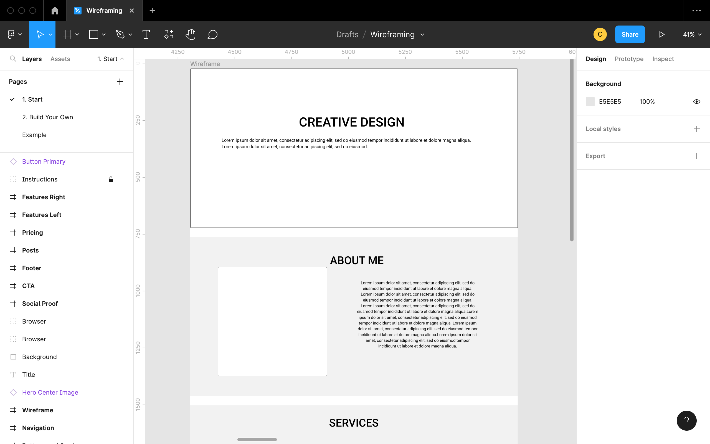
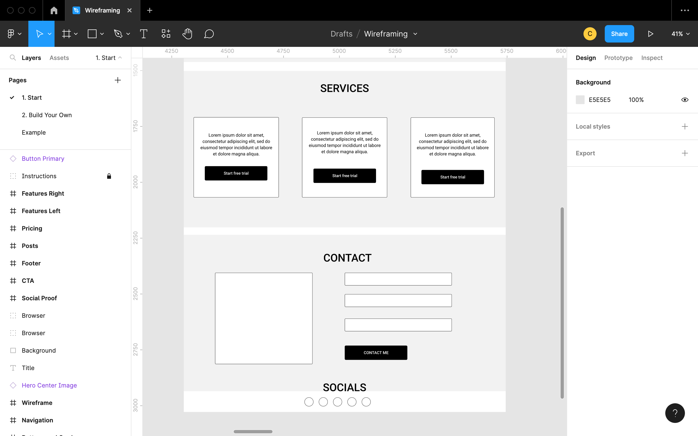

### Layout:

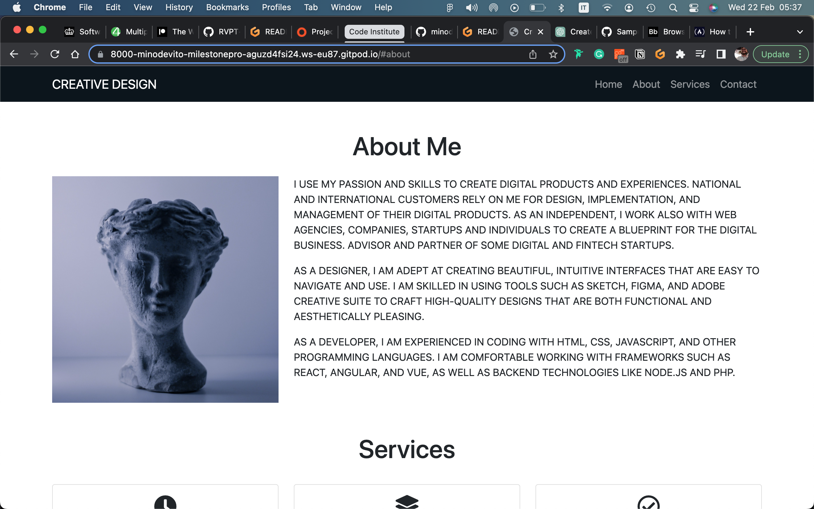
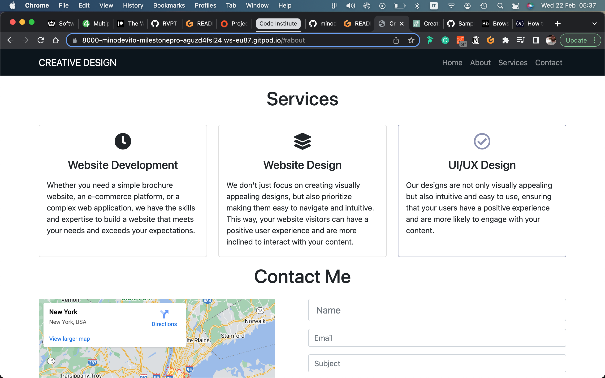

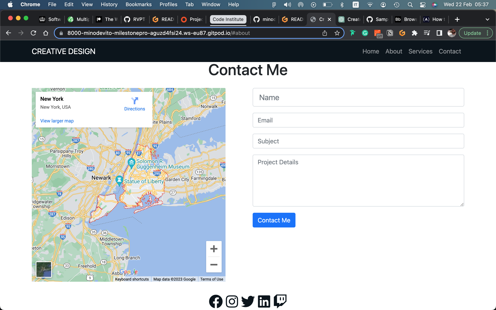

## TESTING

### Testing of website
| Feature | Expect | Action | Result |
| --- | --- | --- | --- |
| Home Navbar Button | When clicked, the home page will open | Clicked Home on the Navbar | Home page opened when clicked - Success |
| All other nav elements | When I click on 'Home' 'About' or 'Service' and 'Contact' on the Navbar, the relevant section will show | Clicked 'Home' 'About' or 'Service' and 'Contact' on the Navbar | It scrolls down till the relevant section - Success |
| Facebook link | When clicked, I will be redirected to the businesses Facebook account | Clicked Facebook icon in the footer section | Was redirected to the facebook page - Success |
| Instagram link | When clicked, I will be redirected to the businesses Instagram account | Clicked Instagram icon in the footer section | Was redirected to the Instagram page - Success |

### Content responsiveness: 

This portfolio has been designed with content responsiveness in mind, to ensure that it looks great and is easy to use across a wide range of devices and screen sizes.

To achieve this, the site layout and design are built using responsive design principles and are optimized for a variety of screen sizes, including desktops, laptops, tablets, and mobile devices. This means that the content will automatically adjust and adapt to fit the size and shape of the user's screen, ensuring that it is always easy to read and navigate.

In addition, the site's images and multimedia content are optimized for fast loading times and compatibility with a range of devices and browsers. This means that users on slow connections or older devices will still be able to access and enjoy the portfolio's content without any issues.

Overall, this portfolio has been designed to provide a seamless and enjoyable user experience, regardless of the user's device or screen size. If you encounter any issues with content responsiveness or have any suggestions for improvement, please feel free to reach out and let me know.

### Design
The design of this portfolio has been carefully crafted to showcase my professional background and creative abilities in a visually appealing and easy-to-navigate format.

The color scheme and typography of the portfolio have been thoughtfully chosen to present a professional and polished image while reflecting my personality and style. The color palette and font selection are harmonious, and the typography is legible and easy on the eyes.

To enhance the visual appeal and engagement of the portfolio, high-quality images and multimedia content have been incorporated throughout. These have been carefully selected and optimized to load quickly and be compatible with a range of devices and browsers.

Overall, the design of this portfolio aims to strike a balance between professionalism and personality, while also showcasing my skills and experience in a visually compelling way.

### Website viewport for iPad:
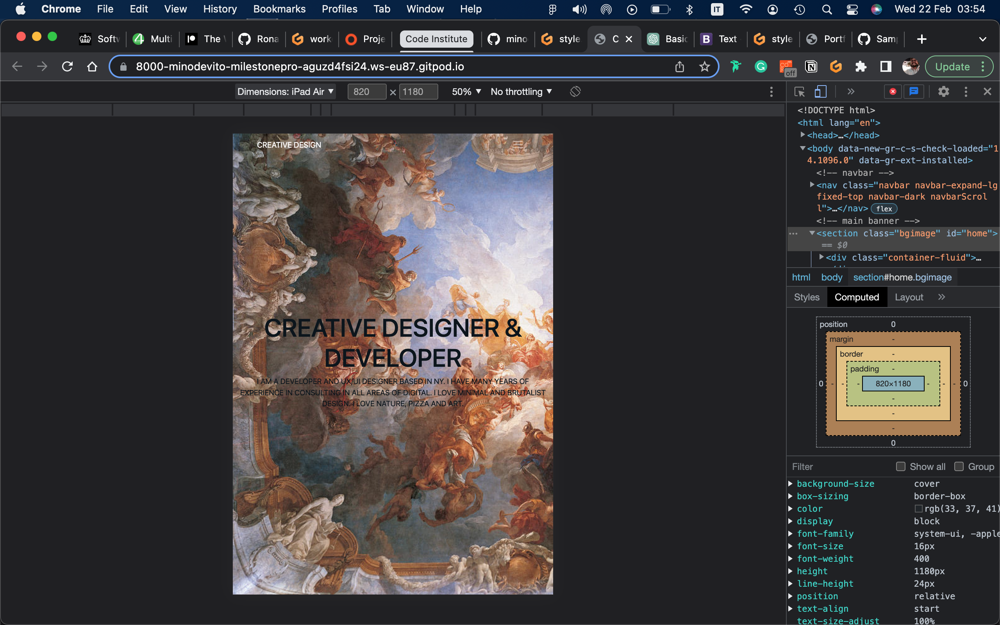

### Website viewport for iphone:  
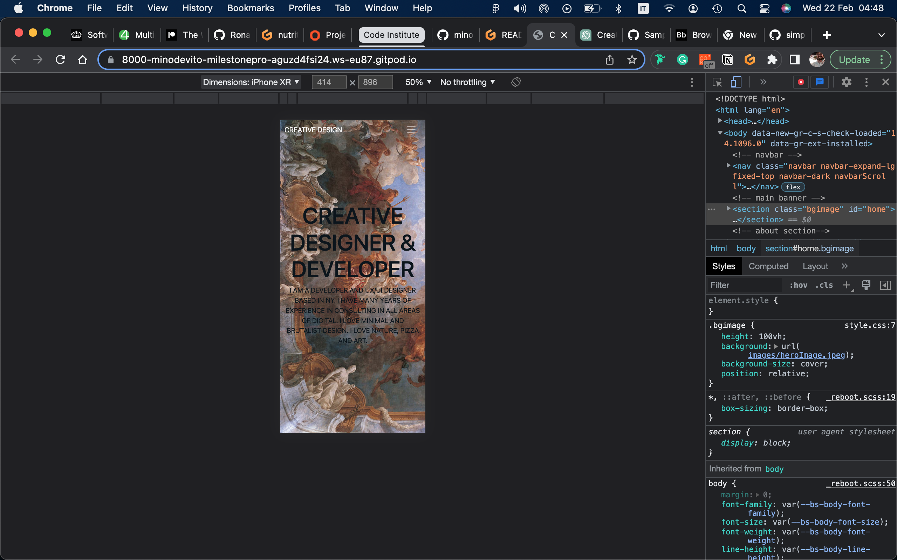

### Testing:

The W3C Markup Validator and W3C CSS Validator Services were used to validate every page of the project to ensure there were no syntax errors in the project.

### Testing of HTML: 
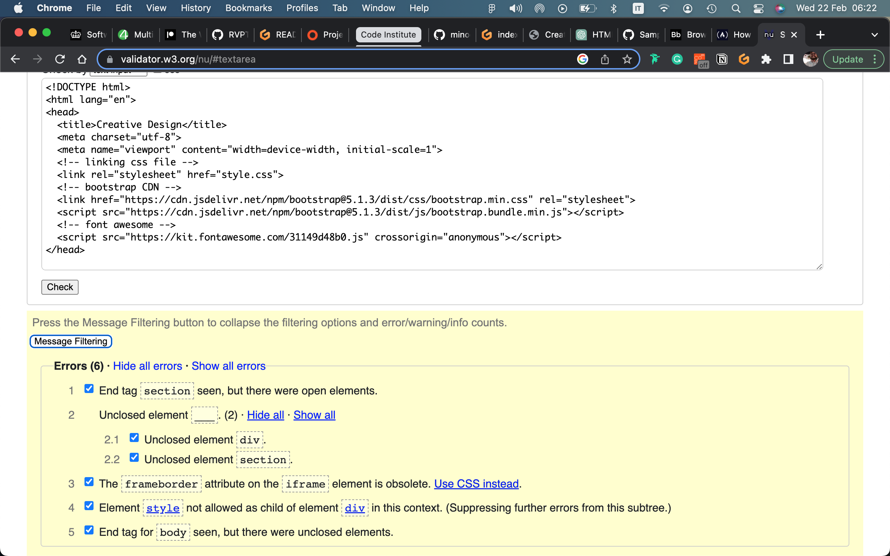
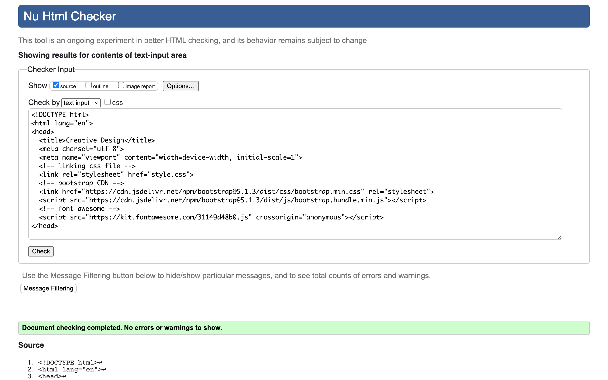

### Testing of CSS:
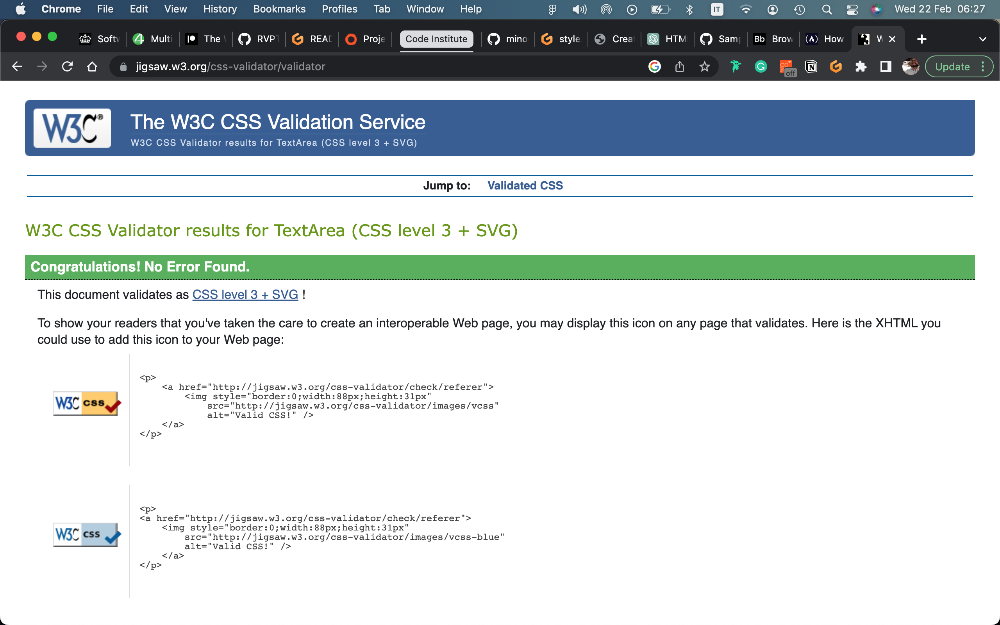

### Testing of JS:
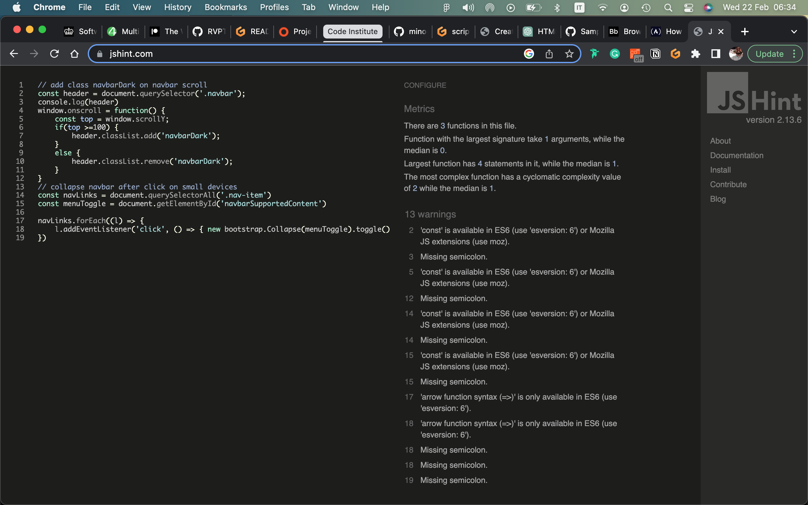

### Lighthouse testing for performance, accessibility and best practices:

### Further Testing
-   The Website was tested on Google Chrome, Internet Explorer, Microsoft Edge and Safari browsers.
-   The website was viewed on a variety of devices such as Desktop, Laptop, iPhone12 and iPhoneXR.
-   A large amount of testing was done to ensure that all pages were linking correctly.

## UNFIXED BUGS
- 

## DEPLOYMENT
The project was developed in Gitpod, committed and push to GitHub through using the terminal section in Gitpod.
To deploy this page to GitHub pages from its GitHub repository, the following steps were taken:
1. Log into GitHub
2. From the list of repositories on the screen, select 'Milestone-Project'.
3. From the menu list near the top below the project name, select settings
4. There will be a nav down the left of the screen. Find pages and select it when found
5. Select the branch dropdown which will say none and change it to main
6. Press the save button to the right of it

How to run this project locally:
1. To clone this project into Gitpod you will need a GitHub account
2. Use the Chrome browser

Then follow the steps:
1. Install Gitpod Browser Extensions for Chrome
2. After installation, restart the browser
3. Log into Gitpod with your Gitpod account
4. Navigate to the projet GitHub repository
5. Click the green 'Gitpod' button in the top right corner of the repository
6. This will trigger a new Gitpod workspace to be created from the code in GitHub where you can work locally

## CREDIT  

### Media credit:
- https://www.pexels.com/

#### Links used to help structure README.md file:  
- https://www.freecodecamp.org/news/how-to-write-a-good-readme-file/  

#### Links used to help for CSS styling:  
- https://www.freecodecamp.org/news/how-to-create-a-portfolio-website-using-html-css-javascript-and-bootstrap/ 

#### Links used to help write HTML code:  
- https://www.freecodecamp.org/news/how-to-create-a-portfolio-website-using-html-css-javascript-and-bootstrap/ 

# Tools used #

1. [Bootstrap 5.1.3:](https://getbootstrap.com/docs/4.4/getting-started/introduction/)
    - Bootstrap was used to assist with the responsiveness and styling of the website.
1. [Hover.css:](https://ianlunn.github.io/Hover/)
    - Hover.css was used on the Social Media icons in the footer to add the float transition while being hovered over.
1. [Google Fonts:](https://fonts.google.com/)
    - Google fonts were used to import the 'Titillium Web' font into the style.css file which is used on all pages throughout the project.
1. [Font Awesome:](https://fontawesome.com/)
    - Font Awesome was used on all pages throughout the website to add icons for aesthetic and UX purposes.
1. [Git](https://git-scm.com/)
    - Git was used for version control by utilizing the Gitpod terminal to commit to Git and Push to GitHub.
1. [GitHub:](https://github.com/)
    - GitHub is used to store the projects code after being pushed from Git.
