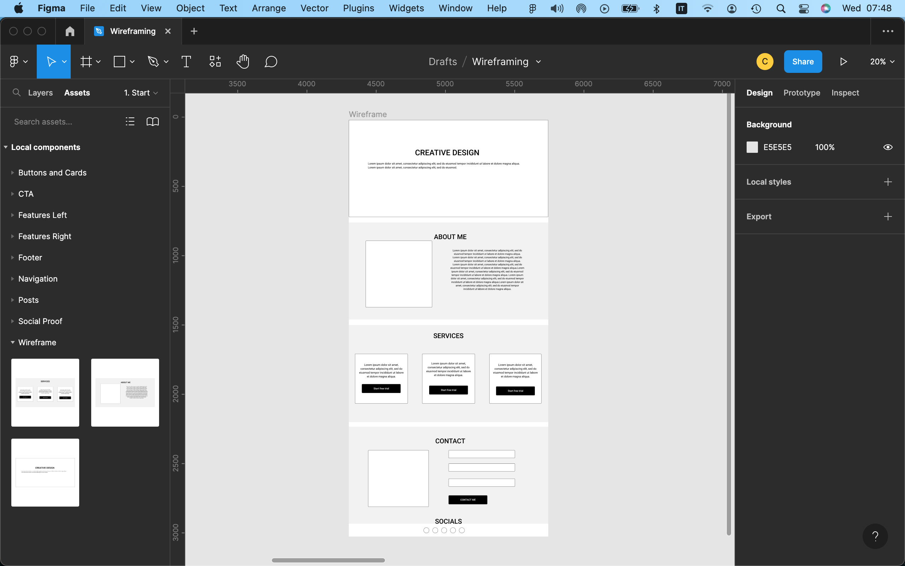
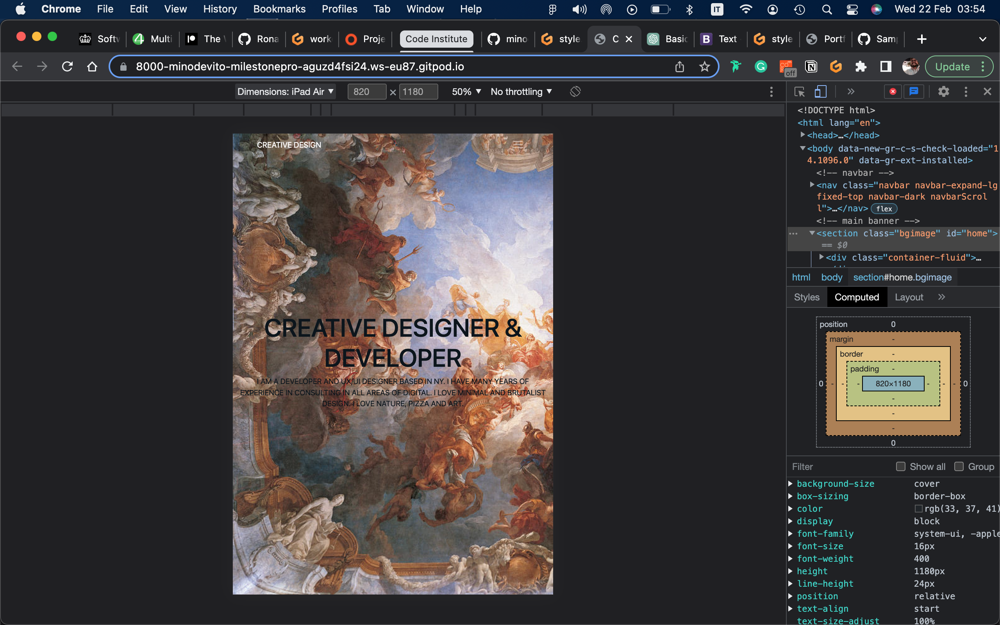
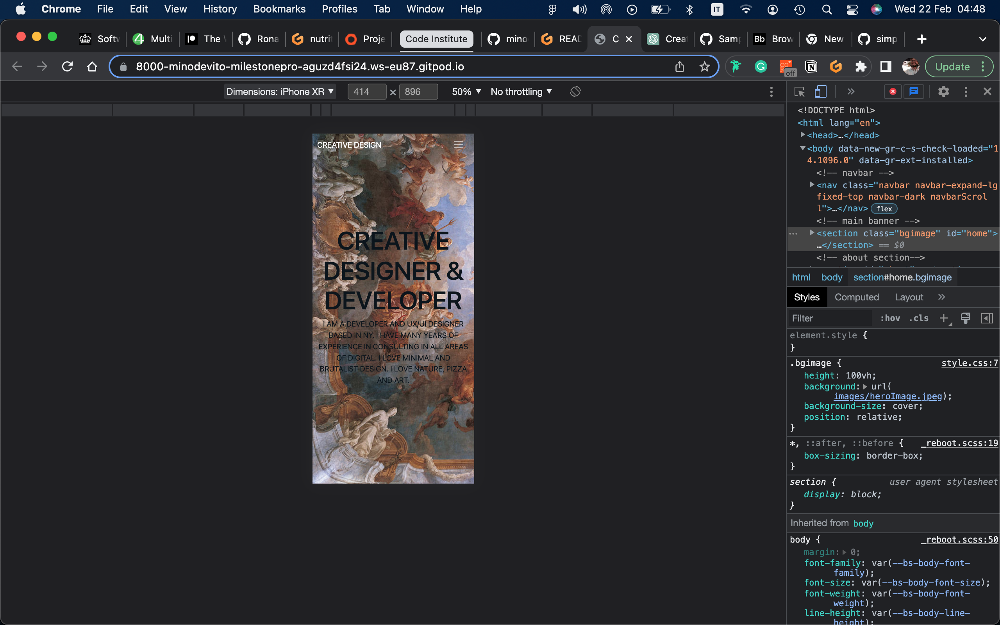
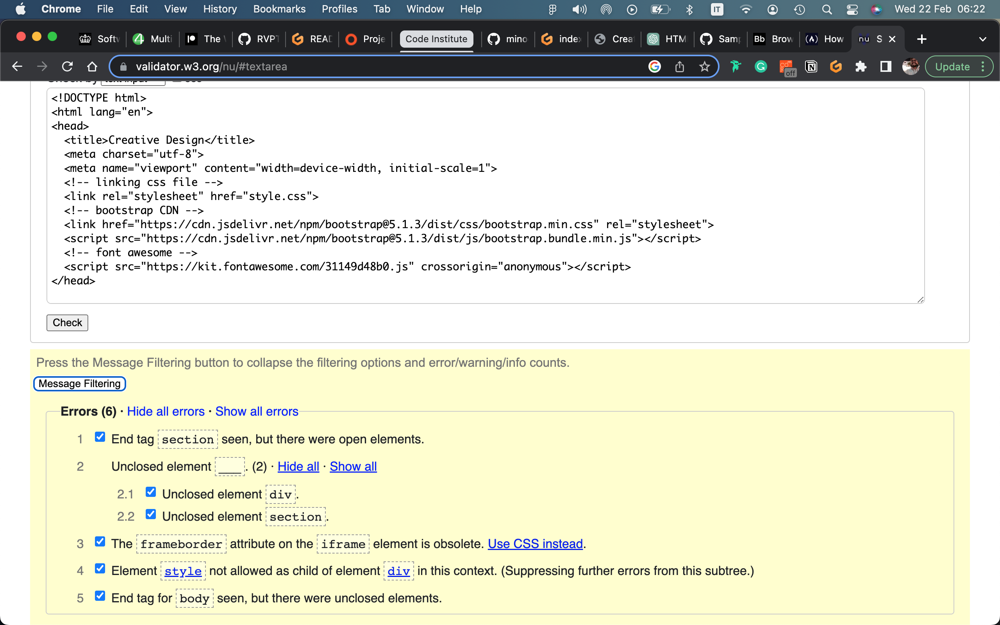
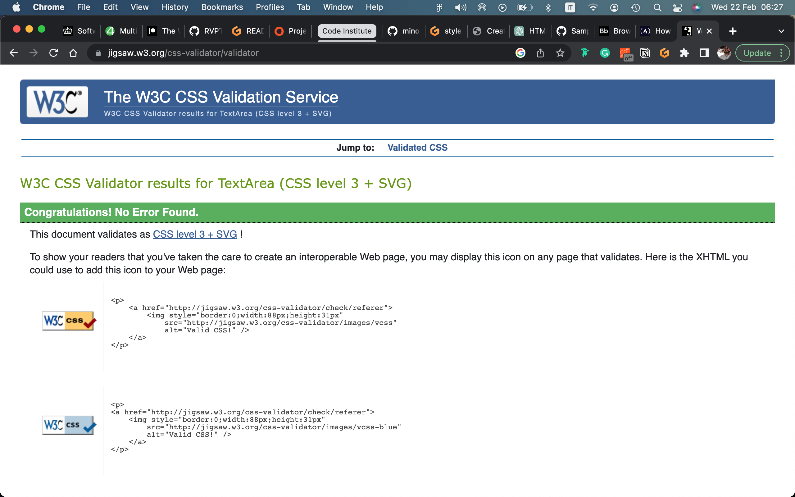
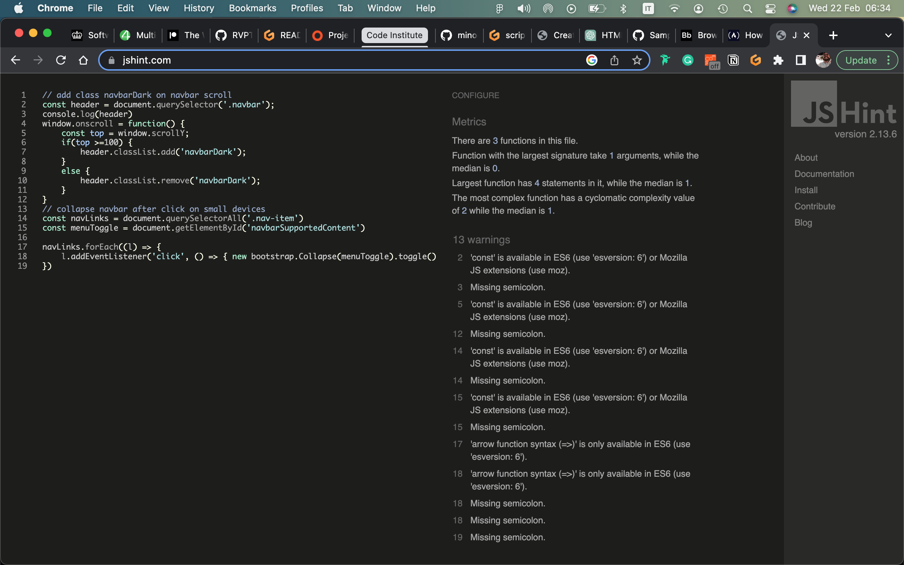
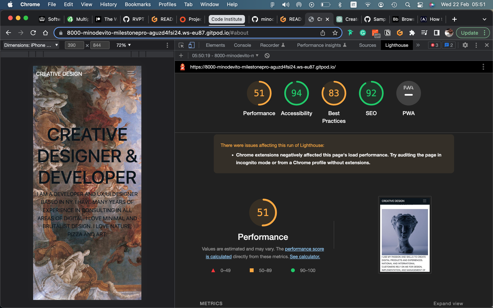

# Milestone-Project: Creative Design

Creative Design is a website that enables to showcase skills, abilities, experiences, and accomplishments to potential employers, clients, or collaborators. By doing so, it helps establish a robust online presence and create a professional brand image that aligns with their values, mission, and target audience.

## TABLE OF CONTENTS
| Section |
| --- |
| [Title and desciption](#milestone-project) |
| [Features](#features) |
| [UX / UI](#uxui-section) |
| [Testing](#testing) |
| [Unfixed Bugs](#unfixed-bugs) |
| [Deployment](#deployment) |
| [Credit](#credit) |
| [Future Features](#future-features) |

## FEATURES
- Responsive navigation bar that collapses into a hamburger menu on smaller screens for better user experience.
- Hero section featuring a captivating background image and a prominent title and description that immediately grabs the user's attention.
- About section showcasing the designer's experience and skills through a carefully curated image and informative text.
- Services section that presents three distinct web development services using eye-catching cards to capture the user's interest.
- Contact section with a user-friendly form that allows visitors to easily send messages to the designer.

## UX/UI SECTION 

### Wireframes:
- 

### Layout:
- ![Layout] (assets/img/layout-1.png)
- ![Layout] (assets/img/layout-2.png)
- ![Layout] (assets/img/layout-3.png)
- ![Layout] (assets/img/layout-4.png)
- ![Layout] (assets/img/layout-5.png)
- ![Layout] (assets/img/layout-6.png)

## TESTING

### Testing of website
| Feature | Expect | Action | Result |
| --- | --- | --- | --- |
| Home Navbar Button | When clicked, the home page will open | Clicked Home on the Navbar | Home page opened when clicked - Success |
| All other nav elements | When I click on 'Home' 'About' or 'Service' and 'Contact' on the Navbar, the relevant section will show | Clicked 'Home' 'About' or 'Service' and 'Contact' on the Navbar | It scrolls down till the relevant section - Success |
| Facebook link | When clicked, I will be redirected to the businesses Facebook account | Clicked Facebook icon in the footer section | Was redirected to the facebook page - Success |
| Instagram link | When clicked, I will be redirected to the businesses Instagram account | Clicked Instagram icon in the footer section | Was redirected to the Instagram page - Success |

### Content responsiveness: 

### Website viewport for iPad:
- 

### Website viewport for iphone:  
- 

### Testing of HTML:  
- 

### Testing of CSS:  
- 

### Testing of JS:
- 

### Lighthouse testing for performance, accessibility and best practices:
- 

## UNFIXED BUGS
- 

## DEPLOYMENT
The project was developed in Gitpod, committed and push to GitHub through using the terminal section in Gitpod.
To deploy this page to GitHub pages from its GitHub repository, the following steps were taken:
1. Log into GitHub
2. From the list of repositories on the screen, select RVPT-website
3. From the menu list near the top below the project name, select settings
4. There will be a nav down the left of the screen. Find pages and select it when found
5. Select the branch dropdown which will say none and change it to main
6. Press the save button to the right of it

How to run this project locally:
1. To clone this project into Gitpod you will need a GitHub account
2. Use the Chrome browser

Then follow the steps:
1. Install Gitpod Browser Extensions for Chrome
2. After installation, restart the browser
3. Log into Gitpod with your Gitpod account
4. Navigate to the projet GitHub repository
5. Click the green 'Gitpod' button in the top right corner of the repository
6. This will trigger a new Gitpod workspace to be created from the code in GitHub where you can work locally

## CREDIT  

### Media credit:
- https://www.pexels.com/

#### Links used to help structure README.md file:  
- https://www.freecodecamp.org/news/how-to-write-a-good-readme-file/  

#### Links used to help for CSS styling:  
- https://www.freecodecamp.org/news/how-to-create-a-portfolio-website-using-html-css-javascript-and-bootstrap/ 

#### Links used to help write HTML code:  
- https://www.freecodecamp.org/news/how-to-create-a-portfolio-website-using-html-css-javascript-and-bootstrap/ 

# Tools used #

- HTML, CSS and JavaScript
- [Bootstrap 5](https://getbootstrap.com/docs/5.0/getting-started/introduction/)
- [Font Awesome 5](https://fontawesome.com/)
- [google map](https://www.embed-map.com/)